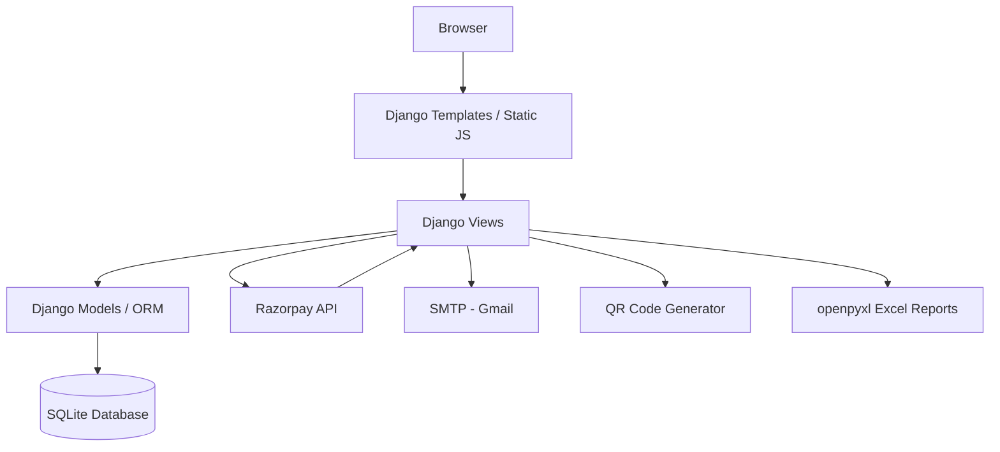
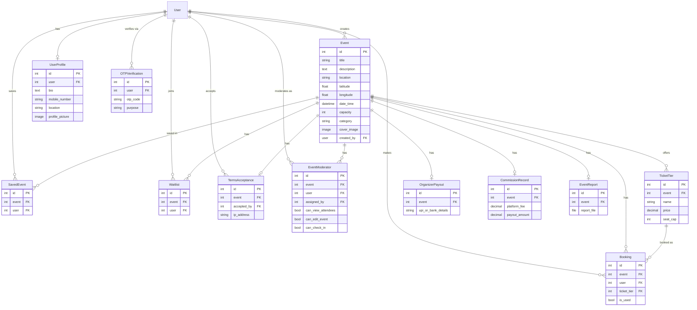

<div align="center">

# 🎉 EventHub

### *Discover · Book · Experience*


**A full-stack Django event management platform** — organizers create and monetize events with tiered ticketing and live seat tracking, attendees discover, book, and pay for tickets, and a built-in admin layer handles verification, moderation, payouts, and reporting.

🌐 **Live Demo:** <!-- PASTE YOUR DEPLOYED LINK HERE ONCE LIVE, e.g. https://eventhub.onrender.com -->
🎥 **Demo Video:** <!-- PASTE YOUR YOUTUBE LINK HERE, e.g. https://youtu.be/xxxxxxx -->

⭐ *If this project is useful to you, consider starring the repo.*

</div>

---

## 📚 Table of Contents

- [Features](#-features)
- [Project Stats](#-project-stats)
- [Screenshots](#-screenshots)
- [Architecture](#️-architecture)
- [Database Schema](#️-database-schema)
- [Tech Stack](#️-tech-stack)
- [Getting Started](#-getting-started)
- [Environment Variables](#-environment-variables)
- [Project Structure](#-project-structure)
- [Security](#-security)
- [Deployment](#-deployment)
- [Roadmap](#️-roadmap)
- [Troubleshooting](#-troubleshooting)
- [Contributing](#-contributing)
- [License](#-license)
- [Contact](#-contact)

---

## ✨ Features

### 🎪 Event Management
- Create, edit, and delete events with a title, description, location, date/time, capacity, category, and cover image
- Preset categories (Tech, Music, Sports, Business) or fully custom categories
- Location geocoding with latitude/longitude, so events can be shown on a map
- Countdown timer on every event page
- Save/wishlist events, plus a waitlist users can join once an event is full

### 🎟️ Flexible Ticket Tiers & Payments
- Multiple custom ticket tiers per event (e.g. General, VIP, RSVP), each with its own name, price, and seat cap
- Free tickets supported (price = 0) alongside paid tiers
- Tier capacity and overall event capacity are both enforced
- Integrated **Razorpay** checkout for paid tickets, with server-side order creation and signature-verified payment confirmation
- Auto-generated **QR code** on every booking, plus a ticket verification/check-in view for staff at the door (single-use — a scanned ticket can't be reused)

### ⚡ Real-Time Seat Availability
- Live seat ticker per tier, polled every few seconds without a full page refresh
- Sold-out tiers auto-disable instantly on the booking form

### 🔐 Authentication & Account Security
- Registration with email OTP verification
- OTP-based "forgot password" flow
- OTP verification required before an email-address change takes effect
- Change-password flow that re-checks the current password
- Custom 404 / 500 error pages

### 👤 User Profiles
- Editable bio, mobile number, location, and profile picture
- Personal booking history, saved events, and cancellation support

### 🛡️ Organizer & Admin Tools
- **Organizer dashboard**: bookings, revenue, and attendee list per event, with QR check-in
- **Event moderators**: an organizer can delegate per-event permissions (view attendees, edit event, check in attendees) to other users
- **Super admin dashboard**: platform-wide totals for events, bookings, users, and revenue, plus the ability to grant a "Verified Organizer" badge
- **Automatic commission engine**: platform fee is calculated per event (5% up to ₹1,00,000 in revenue, 10% above), with the organizer payout computed automatically
- **Organizer payout records**: UPI/bank details stored per event for settlement
- **Event lifecycle**: organizers can mark an event as finished, which generates an **Excel report** (via openpyxl) of tickets sold, revenue, platform fee, and payout
- **Terms & conditions acceptance** is recorded per event with the accepting user and IP address

### 📧 Transactional Email
- Welcome + OTP email on registration
- Password-reset OTP email
- Email-change verification OTP

### 🌐 Static Pages
- About and Contact pages

---

## 📊 Project Stats

| Metric | Count |
|---|---|
| Python files | 13 |
| Django models | 12 |
| View functions | 40 |
| HTML templates | 33 |
| Database migrations | 14 |
| Lines of Python code | ~2,100 |

---

## 📸 Screenshots

> Screenshots live in the `Screenshots/` folder at the repo root — drop your images in with the filenames below (or rename the `src` paths to match your own filenames).

<table>
<tr>
<td align="center"><b>Home / Event Listing</b><br></td>
<td align="center"><b>Event Detail</b><br></td>
</tr>
<tr>
<td align="center"><b>Booking / Checkout</b><br></td>
<td align="center"><b>Payment (Razorpay)</b><br></td>
</tr>
<tr>
<td align="center"><b>QR Ticket / Check-in</b><br></td>
<td align="center"><b>Organizer Dashboard</b><br></td>
</tr>
<tr>
<td align="center"><b>Super Admin Dashboard</b><br></td>
<td align="center"><b>User Profile</b><br></td>
</tr>
</table>

---

## 🏗️ Architecture



Templates render server-side, views hold all business logic (booking, payments, reports), and the ORM talks to SQLite. Razorpay, email, QR generation, and Excel export are called from the view layer as needed — a standard Django MVT structure, no separate API layer yet.

---

## 🗄️ Database Schema



---

## 🛠️ Tech Stack

| Layer | Technology |
|---|---|
| Backend | Django 5.2.11 (Python 3.11) |
| Database | SQLite (development) |
| Payments | Razorpay |
| Auth | Django Auth + custom email OTP flows |
| Email | SMTP (Gmail) |
| QR Codes | `qrcode` |
| Images | Pillow |
| Reports | openpyxl (Excel export) |
| Env Management | python-dotenv |
| Frontend | HTML · CSS · Vanilla JS · Bootstrap |

---

## 🚀 Getting Started

### Prerequisites
- Python 3.11+
- Git
- A Gmail account with an [App Password](https://myaccount.google.com/apppasswords) (for sending OTP emails)
- A [Razorpay](https://razorpay.com/) account (test-mode keys are fine for local development)

### 1. Clone the repo
```bash
git clone https://github.com/Himanshu-029/EVENT-MANAGEMENT-SYSTEM.git
cd EVENT-MANAGEMENT-SYSTEM/event_management
```

### 2. Create a virtual environment
```bash
python -m venv venv

# Windows
venv\Scripts\activate

# Mac/Linux
source venv/bin/activate
```

### 3. Install dependencies
```bash
pip install -r requirements.txt
```

### 4. Set up environment variables
Copy the template and fill in your real values — it lives inside the inner `event_management/` package, next to `settings.py`:

```bash
cd event_management
cp .env.example .env
```

```env
SECRET_KEY=your-django-secret-key
DEBUG=True
ALLOWED_HOSTS=localhost,127.0.0.1

EMAIL_HOST_USER=your-email@gmail.com
EMAIL_HOST_PASSWORD=your-gmail-app-password

RAZORPAY_KEY_ID=your-razorpay-key-id
RAZORPAY_KEY_SECRET=your-razorpay-key-secret
```

> 💡 Generate a Django secret key at [djecrety.ir](https://djecrety.ir)
> 💡 Get a Gmail App Password at [myaccount.google.com/apppasswords](https://myaccount.google.com/apppasswords)
> 💡 Get Razorpay test keys from the [Razorpay Dashboard](https://dashboard.razorpay.com/)
> ⚠️ Never commit your real `.env` — only `.env.example` should be tracked in git.

### 5. Run migrations
```bash
python manage.py makemigrations
python manage.py migrate
```

### 6. Create a superuser (admin)
```bash
python manage.py createsuperuser
```

### 7. Start the server
```bash
python manage.py runserver
```

Visit → [http://127.0.0.1:8000](http://127.0.0.1:8000) 🎉

---

## 🔑 Environment Variables

| Variable | Description | Required |
|---|---|---|
| `SECRET_KEY` | Django secret key | ✅ |
| `DEBUG` | `True` for development, `False` in production | ✅ |
| `ALLOWED_HOSTS` | Comma-separated list of allowed hosts | ✅ |
| `EMAIL_HOST_USER` | Gmail address used to send OTP/notification emails | ✅ |
| `EMAIL_HOST_PASSWORD` | Gmail App Password | ✅ |
| `RAZORPAY_KEY_ID` | Razorpay API key ID | ✅ |
| `RAZORPAY_KEY_SECRET` | Razorpay API key secret | ✅ |

---

## 📁 Project Structure

```
EVENT-MANAGEMENT-SYSTEM/
├── README.md
├── .gitignore
├── Screenshots/                ← README screenshots (home, booking, dashboards, etc.)
└── event_management/
    ├── requirements.txt
    ├── manage.py
    ├── db.sqlite3
    ├── event_management/
    │   ├── settings.py
    │   ├── urls.py
    │   ├── asgi.py
    │   ├── wsgi.py
    │   └── .env.example         ← copy this to .env and fill in real values
    ├── events/
    │   ├── models.py            ← Event, TicketTier, Booking, SavedEvent, Waitlist,
    │   │                           OrganizerPayout, CommissionRecord, TermsAcceptance,
    │   │                           EventModerator, EventReport, UserProfile, OTPVerification
    │   ├── views.py              ← all views, Razorpay integration, Excel report generation
    │   ├── urls.py               ← URL routing
    │   ├── admin.py
    │   ├── apps.py
    │   ├── migrations/
    │   ├── static/
    │   │   ├── css/
    │   │   └── images/
    │   └── templates/events/    ← event pages, dashboards, profile, booking flow
    ├── templates/
    │   ├── 404.html / 500.html
    │   └── registration/         ← login, register, OTP, password reset
    └── media/                    ← uploaded event images, profile pictures, QR codes
```

---

## 🔒 Security

Implemented today:
- Django's built-in password hashing and session-based auth
- CSRF protection on all forms
- Email OTP verification for registration, password reset, and email changes
- Razorpay payment signatures are verified server-side before a booking is confirmed
- QR tickets are single-use — a booking is flagged as used on first check-in

Worth hardening before/while going to production:
- `DEBUG` must be set to `False` and `ALLOWED_HOSTS` locked down for your real domain
- No `SECURE_SSL_REDIRECT` / `SESSION_COOKIE_SECURE` / `CSRF_COOKIE_SECURE` yet — add these once you're serving over HTTPS
- Seat-capacity checks aren't yet wrapped in a database transaction/lock, so two people booking the last seat at the exact same instant could both succeed — fine for a demo, worth fixing with `transaction.atomic()` + `select_for_update()` before real traffic

---

## 🌍 Deployment

Not yet deployed — <!-- once live, add the platform you used here, e.g. "currently deployed on Render" --> planned deployment stack:

| Concern | Suggested choice |
|---|---|
| Hosting | Render / Railway |
| WSGI server | Gunicorn |
| Static files | WhiteNoise |
| Database | PostgreSQL |
| Media storage | AWS S3 (SQLite + local media don't survive redeploys on most free hosts) |

Before deploying: set `DEBUG=False`, move off SQLite, and add the HTTPS/cookie settings noted above.

---

## 🗺️ Roadmap

- [ ] PostgreSQL support for production deployments
- [ ] Social sharing buttons on event pages
- [ ] Event search/filter by date range and location radius
- [ ] Automated refunds through Razorpay on cancellation
- [ ] REST API layer (Django REST Framework)
- [ ] Mobile app (React Native)

---

## 🛠 Troubleshooting

**Migrations not applying**
```bash
python manage.py makemigrations
python manage.py migrate
```

**Static files not loading**
```bash
python manage.py collectstatic
```

**Razorpay payment failing** — double check `RAZORPAY_KEY_ID` / `RAZORPAY_KEY_SECRET` in `.env` match your dashboard's test-mode keys.

**OTP emails not sending** — confirm `EMAIL_HOST_USER` is correct and `EMAIL_HOST_PASSWORD` is a Gmail **App Password**, not your regular account password.

---

## 🤝 Contributing

Pull requests are welcome! For major changes, please open an issue first to discuss what you'd like to change.

1. Fork the repo
2. Create your branch (`git checkout -b feature/cool-feature`)
3. Commit your changes (`git commit -m 'Add cool feature'`)
4. Push to the branch (`git push origin feature/cool-feature`)
5. Open a Pull Request

---

## 📄 License

<!-- No LICENSE file currently exists in this repo. To make the MIT claim below true, generate one at https://choosealicense.com/licenses/mit/ and add a LICENSE file to the repo root — otherwise remove this section. -->
This project is licensed under the MIT License — see the `LICENSE` file for details.

---

## 📬 Contact

**Himanshu Giri**
GitHub: [@Himanshu-029](https://github.com/Himanshu-029)
LinkedIn: <!-- paste your LinkedIn URL here -->
Email: <!-- paste your contact email here -->

---

<div align="center">

Made with 💖 by **Himanshu**

*If you found this useful, drop a ⭐ on the repo!*

</div>